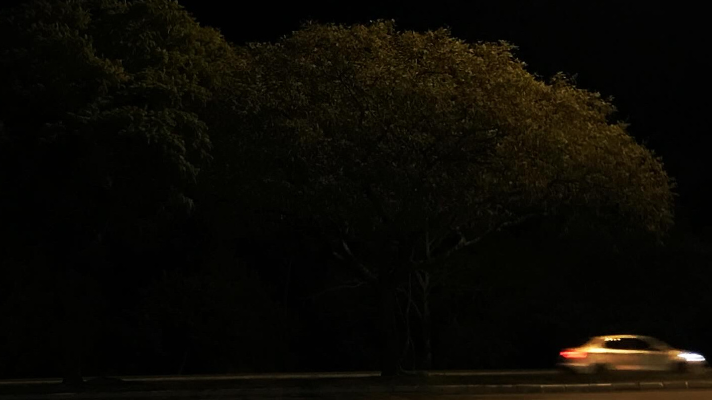

---
{"date":"2024-07-24","tags":["poem","done"],"topic":null,"publish":true,"PassFrontmatter":true}
---


```elite
Friedrich,
Once more, the Pale Blue Dot stares into the Abyss,  
but the Abyss does not care to return wish.  
No longer an endless ellipse, but a dizzying twist.

They rush past at such speed,  
unaware of lost creed:

Windless Storms on Mount Unrest leave us petrified,  
Ungainly Spectacles of Dying Lights keep us mystified,  
Sterile Exercises on Grand Subjects keep us colonized,  
Until exhaustion drags us for the Absurd’s tide.  

I fear they’ll fall for life, then die in fright.
True, Lakehouse Trees stand forever grounded.
Yet what am I to be when roots rot new bright horizons?

Always,
    DBW.
```
\- [[Gabriel Lima Jacinto\|Gabriel Lima Jacinto]], Branching out or the Earth and the Abyss ([[zettlekasten/D.B.W\|D.B.W]])