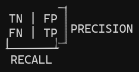

---
{"date":"2023-12-12","tags":["info/lesson","done"],"topic":"[[Machine Learnig]]","class":"[[Courses#^ddc1b1|Hands-On Machine Learning]]","professor":"Aurélien Géron","place":"Coffee Shop","publish":true,"PassFrontmatter":true}
---

# Types of Machine Learning Systems

1. [[Online Learning\|Online Learning]] vs. [[Batch Learning\|Batch Learning]]
2. [[Supervised Learning\|Supervised Learning]], [[Unsupervised Learning\|Unsupervised Learning]], [[Semi-supervised Learning\|Semi-supervised Learning]], [[Reinforcement Learning\|Reinforcement Learning]]
3. [[Instance-based Learning\|Instance-based Learning]] vs. [[Model-based Learning\|Model-based Learning]]

The way these models learn vary. On the case for model-based supervised learning, they have parameters that compose a function that will describe the behavior of the data. To set the values of such parameters, the algorithm has to practice and learn from the data. In order to assure that it is learning, the objective is to reduce a certain metric, called the cost function ([[Cost Functions\|Cost Functions]]), or increase a metric, called the utility function ([[Utility Functions\|Utility Functions]]). 

But having a low cost function is not enough. To verify if the algorithm is not memorizing the data but learning, we evaluate it by using data it was not trained on and measure it with a performance measure ([[Performance Measures\|Performance Measures]]) to check if the predictions are as expected.

The best practice to check for the [[Overfit\|overfit]] is to use a validation set and a train-dev set, which are subsets from the training set.

*The train-dev set is also used to verify for data mismatch ([[Data Mismatch\|Data Mismatch]])*
*The validation is also mainly used to compare models*

If the model stills overfits, the three common solutions are to reduce the models complexity, get more data or to remove noise from the data.
Furthermore, to improve the performance even more, it is recommended that a fine-tuning is done on the learning algorithm's hyperparameters ([[Models' Hyperparameters\|Models' Hyperparameters]]), that will help to tailor better values to the model's parameters ([[Models' Parameters\|Models' Parameters]]).

Thus, the 8 main steps to complete a Machine Learning projects is:

	1. Understand the problem            5. Select models and train
	2. Get the data                      6. Finetune the best model
	3. Gain                              7. Present the solution
	4. Clean and prepare the dataset     8. Launch and maintain

Some parts of step 4 can be automated with the help of pipelines.

Step 5 can be done with [[Cross-validation\|cross-validation]] so you can get a better look at the model's evaluation, since it take a number K of folds and creates different models to train on them randomly. 

For step number 6, a good way to find the best hyperparameters configuration to fine tune the model is to perform a [[Grid Search\|Grid Search]] to find the best values. The idea is to create models with varying configurations of hyperparameters and train them using cross-validation. Notice that this technique can take a long time since we are making copies of copies of models with varying inputs (both the hyperparameters for the Grid Search and the dataset for the Cross-validation).
# Classifiers 

Another common task for Machine Learning is classification. Even though the difference between a regression and classification can be blurry sometimes, one thing is sure: it's harder to evaluate a classification model.

There are many [[Performance Measures\|performances measures]] in order to evaluate a classification model. One way is using Cross-Validation, since it evaluates the model on k-folds (k copies of the same model with different configurations). However, since we are measuring for accuracy ([[Accuracy\|Accuracy]], ratio of correct predictions), this value might not mean much for analysis, especially for skewed datasets (see the example on page 90). Therefore there is a better method, which uses calculations based on the Confusion Matrix ([[Confusion Matrix\|Confusion Matrix]]). 

A Confusion Matrix has the following structure:

| Negative Class      | Positive Class      |
| ------------------- | ------------------- |
| True Negative (TN)  | True Positive (TP)  |
| False Positive (FP) | False Negative (FN) |

From these classes, we can extract ratios that help inspect the data.
$$
Precision = \frac{TP}{TP+FP}
$$
$$
Recall_{\space or \space TPR \space or \space Sensitivity} = \frac{TP}{TP+FN}
$$
*Notice that these formulas don't use the True Negative (TN) class*

These metrics are inversely related due to the threshold value ([[library/HOML - Chapter 1, 2, and 3#^cd26ef\|see here]]). To illustrate this relation, see below:

Therefore we have different metrics: accuracy, [[Precision\|precision]], and [[Recall\|recall]]. We can also combine the precision and the recall in one metric, called the F1-score ([[F1-score\|F1-score]]). It is a mathematical ratio called harmonic mean ([[Harmonic Mean\|Harmonic Mean]]). The key idea here is that this mean gives more weight to low values.
$$
F1\space score = \frac{2}{\frac{1}{Precision} + \frac{1}{Recall}} = \frac{2 TP}{2TP + FN + FP} = \frac{TP}{TP + \frac{FN + FP}{2}}
$$
The consequence of the F1-score being a harmonic mean is that it will give better measurements values to classifiers that have similar precision and recall, which is something interesting to have if the values are high, since it means our model is not classifying as many false positives and false negatives.

But the decision of which of these metrics is the best one to use will depend on the application, as exemplified by page 93, since one will give more importance to how many false positives the model had and the other will give more importance to the false negatives.

## Precision Recall trade-off{ #cd26ef}

Either way it is always necessary to look at the precision if we are looking at the recall or vice-versa since only one metric does not guarantee that the model is performing the best it can. Since classification models rely on a [[Decision Functions\|decision function]] to make their decision, they need a threshold value to assert what class the particular instance being analysed belongs to. Depending on this value the model will have a higher or lower recall. What is desired is to have a good trade-off depending on the domain of the problem. 

The lower the threshold value the higher the recall will be since we will basically diminish the likelihood of the model predicting a false negative, if we think of the threshold value as a limiting factor, if its value is low, there will be almost no limiting factor so the odds are that the model will guess correctly all the desired instances. However that will mean that it will guess more false positives as well since it is not as selective on its decision function, so the precision will decrease. 

The counter-intuitive thing about higher values for threshold is that it not always imply in a higher precision. It does imply in lower scores for recall, but it can decrease the precision slightly if we have remove the density of true positives of the positive predictions in the process while keeping the same number of false positives.  

## ROC curve

The receiving operator characteristic (ROC) curve is another way to analyse the trade-off between the values of the confusion table. Before understanding this particular analysis metric, it is necessary to know two other metrics derived from the confusion matrix:
$$
Sensitivity = Recall = TPR_{\space(True\space Positive \space Ratio)}
$$
$$
False\space Positive\space Ratio = 1 - Specificity_{\space(TNR:\space True\space Negative\space Ratio)}
$$
The idea of the ROC curve is to plot the True Positive Ratio (sensitivity) vs. False Positive Ratio ([[Recall\|Sensitivity]], [[True Negative Ratio\|Specificity]]). It will give a log-like graph and the closer to the top-left corner it is the better. It doesn't provide much information on the precision, but the higher the [[Recall\|TPR]] the higher the [[False Positive Ration\|FPR]], so it is important to choose a threshold value that is not to high for these two metrics. 

A good property that we can extract from the ROC curve is the area under the curve (AUC) , since this gives us a comparison tool to decide what model is more fit. The closer to 1 the result is the better is the model to the task in question.

It is preferred to use the Precision vs Recall graph over the [[ROC curve\|ROC curve]] when the number of instances classified in the Positive class or the problem requires more attention to the False Positive values (so the precision needs to be verified, which we can't really get information on the ROC curve).

## Multiclass Classification

Another way to use binary classifiers is to make predictions to more than just one class. There are different strategies to that. We can train a model to differentiate each of the classes from each other two at a time (for example apple or orange, orange or pineapple, apple or banana etc to all possible combinations), this is known as a [[One vs One (OvO)\|One vs One (OvO)]] strategy. The other option is to train the model to decide whether it is the desired class or not, this is known as [[One vs Rest (OvR)\|One vs Rest (OvR)]] strategy (apple or not apple, orange or not orange etc). 

Clearly OvO will train more classifiers and will consume more compute, since it will have to take into account $\frac{N*(N-1)}{2}$ combinations, and if we choose to use a training algorithm such as cross-validation we will reach even a higher number of models. However the advantage of OvO is that we have a [[Dimensionality Reduction\|dimensionality reduction]] of sorts since we only need to train each classifier on a subset of the dataset that has the data for the two classes to be identified. 

The choice between strategies will vary in performance from model to model, but most of the times libraries such as [[Sci-kit Learn\|Sci-kit Learn]] will already have that choice defaulted as [[One vs Rest (OvR)\|OvR]]. Algorithms that don't scale well with huge datasets (such as [[Support Vector Machines\|SVMs]]) will have as default[[One vs One (OvO)\| OvO]].

There are two other classes of classifiers: the [[Multi-label Classifiers\|multi-label classifier]] (faces recognition) and the [[Multi-output Classifiers\|multi-output classifiers]] (remove noise from image pixel-by-pixel).

---
# Questions
1. [[Why is that a random classifier has a AUC score of 0.5? What is the mathematical property in question here? Reminds me of monte carlo for some reason. Is it the probability of its random choices? Oh it is, we are talking binary classifiers, of course it will be 50-50.\|Why is that a random classifier has a AUC score of 0.5? What is the mathematical property in question here? Reminds me of monte carlo for some reason. Is it the probability of its random choices? Oh it is, we are talking binary classifiers, of course it will be 50-50.]]

---
# References
> [[Hands-On Machine Learning with Scikit-Learn, Keras & TensorFlow\|Hands-On Machine Learning with Scikit-Learn, Keras & TensorFlow]]

___
# Questions (by ChatGPT)
#flashcards/homl

Evaluate a classification model using a method suitable for skewed datasets :: Cross-Validation is often used to evaluate classification models on k-folds, but accuracy may be inadequate for skewed datasets. Instead, metrics based on the Confusion Matrix provide a more insightful analysis.
<!--SR:!2023-12-23,1,210-->

Describe the structure of a Confusion Matrix :: A Confusion Matrix consists of four classes: True Negative (TN), True Positive (TP), False Positive (FP), and False Negative (FN), organized into a matrix format.
<!--SR:!2023-12-24,3,250-->

Calculate Precision in the context of a Confusion Matrix :: Precision is calculated as \(\frac{TP}{TP+FP}\), measuring the accuracy of positive predictions among all predicted positive instances.
<!--SR:!2023-12-24,3,250-->

Calculate Recall, True Positive Rate (TPR), or Sensitivity in the context of a Confusion Matrix :: Recall, TPR, or Sensitivity is calculated as $\frac{TP}{TP+FN}$, assessing the ability of the model to capture all positive instances among the actual positive instances.
<!--SR:!2023-12-25,3,250-->

Explain the relationship between precision and recall in classification metrics :: Precision and recall are inversely related due to the threshold value, presenting a trade-off in classification metrics.
<!--SR:!2023-12-25,4,270-->

Define the F1-score and explain its significance :: The F1-score is a metric combining precision and recall into a single value using the harmonic mean. It is expressed as $(\frac{2}{\frac{1}{\text{Precision}} + \frac{1}{\text{Recall}}})$, giving more weight to lower values and providing better measurements for classifiers with similar precision and recall.
<!--SR:!2023-12-24,2,230-->

Explain why the choice of classification metric depends on the application :: The decision of which classification metric to use (accuracy, precision, recall, or F1-score) depends on the application's priorities. For instance, one may prioritize minimizing false positives, while another may focus on minimizing false negatives, as illustrated on page 93.
<!--SR:!2023-12-24,2,230-->

Compare Online Learning and Batch Learning :: Online Learning processes data in a sequential manner, adapting to new observations continuously, while Batch Learning processes data in bulk, requiring the entire dataset to make adjustments to the model.
<!--SR:!2023-12-24,3,250-->

List the types of Supervised Learning :: Supervised Learning, Unsupervised Learning, Semi-supervised Learning, and Reinforcement Learning.
<!--SR:!2023-12-24,3,250-->

Explain the purpose of a Cost Function in model-based supervised learning :: The cost function is a metric used to assess the performance of the model by quantifying the difference between predicted and actual values, guiding the learning algorithm to minimize this difference during training.
<!--SR:!2023-12-24,3,250-->

Define Utility Function in model-based supervised learning :: The utility function is a metric used to evaluate the performance of a model by measuring its effectiveness in increasing desired outcomes, contrasting with the cost function's goal of minimizing errors.
<!--SR:!2023-12-25,4,270-->

Describe the role of a performance measure in evaluating machine learning models :: A performance measure is employed to assess the quality of predictions made by a model on unseen data, ensuring that the model generalizes well and doesn't merely memorize the training set.
<!--SR:!2023-12-24,3,250-->

How can overfitting be assessed in machine learning? :: Overfitting can be assessed by using a validation set and a train-dev set, comparing model performance on these subsets to detect overfitting issues.
<!--SR:!2023-12-24,3,250-->

Name three common solutions for addressing overfitting :: Reduce model complexity, obtain more data, or remove noise from the data.
<!--SR:!2023-12-24,3,250-->

What is the purpose of fine-tuning hyperparameters in machine learning? :: Fine-tuning hyperparameters involves adjusting the configuration of a learning algorithm to optimize model performance and better tailor parameter values for improved accuracy.
<!--SR:!2023-12-25,4,270-->

Enumerate the 8 main steps in a Machine Learning project :: 1. Understand the problem 2. Get the data 3. Clean and prepare the dataset 4. Gain domain knowledge 5. Select models and train 6. Finetune the best model 7. Present the solution 8. Launch and maintain
<!--SR:!2023-12-24,2,230-->

How is cross-validation used in machine learning projects? :: Cross-validation is used in step 5 of a machine learning project to evaluate model performance by dividing the dataset into K folds and training different models on these folds randomly, providing a comprehensive assessment.
<!--SR:!2023-12-24,3,250-->

What is the purpose of a Grid Search in machine learning? :: A Grid Search is employed during step 6 to find the best hyperparameter configuration by creating models with varying hyperparameter settings and training them using cross-validation.
<!--SR:!2023-12-24,3,250-->

Explain the relationship between precision and recall in classification models :: Precision and recall are interdependent metrics in classification models. The choice of a threshold value in the decision function influences both metrics, and achieving a good trade-off is essential for optimal model performance.
<!--SR:!2023-12-24,3,250-->

Describe the impact of threshold values on recall and precision :: Lower threshold values increase recall by reducing the likelihood of false negatives but decrease precision due to higher false positives. Higher threshold values, contrary to intuition, don't always imply higher precision; they decrease recall but may slightly reduce precision if true positives are removed while false positives remain constant.
<!--SR:!2023-12-24,3,250-->

Define the ROC curve and its purpose :: The Receiver Operating Characteristic (ROC) curve is a graphical representation of the trade-off between the True Positive Ratio (sensitivity) and False Positive Ratio (1 - specificity). It provides insights into the performance of a classification model across different threshold values.
<!--SR:!2023-12-25,4,270-->

Explain the metrics derived from the confusion matrix used in ROC curve analysis :: Sensitivity, Recall, and True Positive Ratio (TPR) are synonymous terms representing the ratio of correctly predicted positive instances. False Positive Ratio (FPR) is the complement of specificity (True Negative Ratio or TNR) and measures the ratio of false positives among actual negatives.
<!--SR:!2023-12-24,2,230-->

Discuss the significance of the area under the ROC curve (AUC) :: The AUC of an ROC curve serves as a comparison tool for evaluating different models. A higher AUC value, closer to 1, indicates superior model performance, helping to choose the most suitable model for a given task.
<!--SR:!2023-12-25,4,270-->

Highlight the preference for the Precision vs. Recall graph over the ROC curve in certain scenarios :: The Precision vs. Recall graph is preferred when dealing with a focus on the Positive class or when precision requires closer attention. Unlike the ROC curve, it provides specific information about precision, making it more suitable for addressing particular problem requirements.
<!--SR:!2023-12-25,3,250-->

Define One vs One (OvO) strategy in multiclass classification :: OvO involves training binary classifiers for each pair of classes in a multiclass problem. For example, distinguishing between apple and orange, orange and pineapple, and so on. Although computationally expensive, it offers dimensionality reduction as each classifier trains on a subset of the dataset specific to the two classes being identified.
<!--SR:!2023-12-25,4,270-->

Define One vs Rest (OvR) strategy in multiclass classification :: OvR involves training a binary classifier for each class to determine if an instance belongs to that class or not. For instance, classifying as apple or not apple, orange or not orange, and so forth. While computationally efficient, it may lead to imbalance issues in datasets.
<!--SR:!2023-12-25,4,270-->

Explain the trade-off between OvO and OvR strategies in multiclass classification :: OvO requires training $\frac{N*(N-1)}{2}$ classifiers, where N is the number of classes, making it computationally expensive. However, it offers dimensionality reduction by focusing on subsets of the dataset. OvR, on the other hand, is computationally efficient but may face imbalances in datasets.
<!--SR:!2023-12-24,3,250-->

Discuss the default strategy choices in popular machine learning libraries :: Most machine learning libraries, such as Sci-kit Learn, default to OvR strategy. However, algorithms that do not scale well with large datasets, like Support Vector Machines (SVMs), may default to OvO.
<!--SR:!2023-12-25,4,270-->

Introduce two other classes of classifiers in multiclass classification :: Multi-label classifiers, like those used in face recognition, handle instances that may belong to multiple classes simultaneously. Multi-output classifiers, as seen in image noise removal pixel-by-pixel, predict multiple outputs for each instance.
<!--SR:!2023-12-24,2,230-->