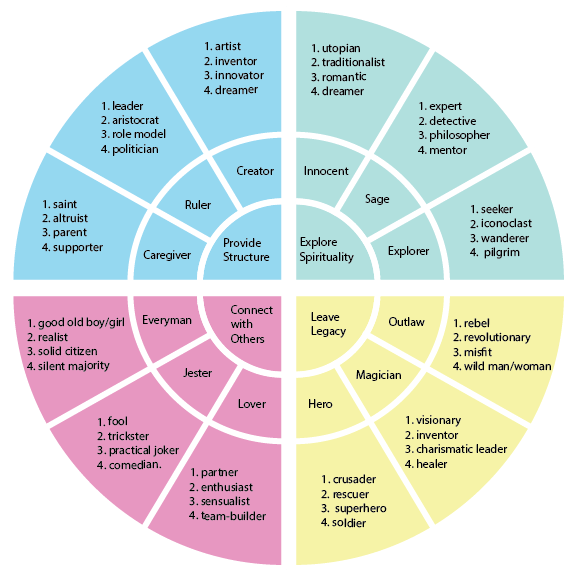

---
{"date":"2024-07-10","tags":["info","done"],"topic":"[[Carl Jung]]","sr-due":"2025-02-22","sr-interval":1,"sr-ease":210,"publish":true,"PassFrontmatter":true}
---

Carl Jung, a Swiss psychiatrist and psychoanalyst, introduced the concept of archetypes, which are universal, archaic symbols and images that derive from the collective unconscious. Here are the 12 Jungian archetypes:

1. **The Innocent**
   - **Motto**: Free to be you and me
   - **Core desire**: To get to paradise
   - **Goal**: To be happy
   - **Greatest fear**: Being punished for doing something bad or wrong
   - **Strategy**: To do things right
   - **Weakness**: Boring for all their naive innocence
   - **Talent**: Faith and optimism

2. **The Orphan/Regular Guy or Gal**
   - **Motto**: All men and women are created equal
   - **Core desire**: Connecting with others
   - **Goal**: To belong
   - **Greatest fear**: To be left out or to stand out from the crowd
   - **Strategy**: Develop ordinary solid virtues, be down to earth, the common touch
   - **Weakness**: Losing one’s own self in an effort to blend in or for the sake of superficial relationships
   - **Talent**: Realism, empathy, lack of pretense

3. **The Hero**
   - **Motto**: Where there’s a will, there’s a way
   - **Core desire**: To prove one’s worth through courageous acts
   - **Goal**: Expert mastery in a way that improves the world
   - **Greatest fear**: Weakness, vulnerability, being a “chicken”
   - **Strategy**: To be as strong and competent as possible
   - **Weakness**: Arrogance, always needing another battle to fight
   - **Talent**: Competence and courage

4. **The Caregiver**
   - **Motto**: Love your neighbor as yourself
   - **Core desire**: To protect and care for others
   - **Goal**: To help others
   - **Greatest fear**: Selfishness and ingratitude
   - **Strategy**: Doing things for others
   - **Weakness**: Martyrdom and being exploited
   - **Talent**: Compassion and generosity

5. **The Explorer**
   - **Motto**: Don’t fence me in
   - **Core desire**: The freedom to find out who you are through exploring the world
   - **Goal**: To experience a better, more authentic, more fulfilling life
   - **Greatest fear**: Getting trapped, conformity, and inner emptiness
   - **Strategy**: Journey, seeking out and experiencing new things, escape from boredom
   - **Weakness**: Aimless wandering, becoming a misfit
   - **Talent**: Autonomy, ambition, being true to one’s soul

6. **The Rebel**
   - **Motto**: Rules are made to be broken
   - **Core desire**: Revenge or revolution
   - **Goal**: To overturn what isn’t working
   - **Greatest fear**: To be powerless or ineffectual
   - **Strategy**: Disrupt, destroy, or shock
   - **Weakness**: Crossing over to the dark side, crime
   - **Talent**: Radical freedom, outrageousness

7. **The Lover**
   - **Motto**: You’re the only one
   - **Core desire**: Intimacy and experience
   - **Goal**: Being in a relationship with the people, work, and surroundings they love
   - **Greatest fear**: Being alone, a wallflower, unwanted, unloved
   - **Strategy**: To become more and more physically and emotionally attractive
   - **Weakness**: Outward-directed desire to please others at risk of losing own identity
   - **Talent**: Passion, gratitude, appreciation, and commitment

8. **The Creator**
   - **Motto**: If you can imagine it, it can be done
   - **Core desire**: To create things of enduring value
   - **Goal**: To realize a vision
   - **Greatest fear**: Mediocre vision or execution
   - **Strategy**: Develop artistic control and skill
   - **Weakness**: Perfectionism, bad solutions
   - **Talent**: Creativity and imagination

9. **The Jester**
   - **Motto**: You only live once
   - **Core desire**: To live in the moment with full enjoyment
   - **Goal**: To have a great time and lighten up the world
   - **Greatest fear**: Being bored or boring others
   - **Strategy**: Play, make jokes, be funny
   - **Weakness**: Frivolity, wasting time
   - **Talent**: Joy

10. **The Sage**
   - **Motto**: The truth will set you free
   - **Core desire**: To find the truth
   - **Goal**: To use intelligence and analysis to understand the world
   - **Greatest fear**: Being duped, misled—or ignorance
   - **Strategy**: Seeking out information and knowledge; self-reflection and understanding thought processes
   - **Weakness**: Can study details forever and never act
   - **Talent**: Wisdom, intelligence

11. **The Magician**
   - **Motto**: I make things happen
   - **Core desire**: Understanding the fundamental laws of the universe
   - **Goal**: To make dreams come true
   - **Greatest fear**: Unintended negative consequences
   - **Strategy**: Develop a vision and live by it
   - **Weakness**: Becoming manipulative
   - **Talent**: Finding win-win solutions, making visions reality

12. **The Ruler**
   - **Motto**: Power isn’t everything, it’s the only thing
   - **Core desire**: Control
   - **Goal**: Create a prosperous, successful family or community
   - **Greatest fear**: Chaos, being overthrown
   - **Strategy**: Exercise power
   - **Weakness**: Being authoritarian, unable to delegate
   - **Talent**: Responsibility, leadership

These archetypes are used to analyze and understand human behavior, motivations, and personality traits.

---
# References
>