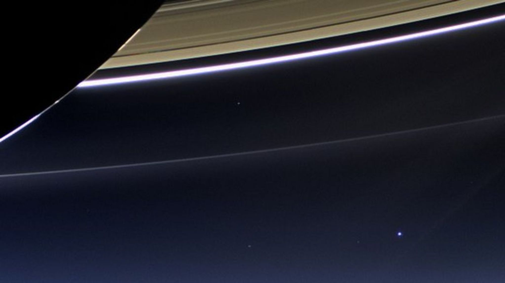

---
{"date":"2023-09-03","tags":["poem" ],"topic":"[[Existentialism]]","publish":true,"PassFrontmatter":true}
---



```elite
Is this it?
A pale blue
A blurry dot
Conscious just to realize it is not special

So...
Is this it?
Bipeds monkeys
That only think with their money
Just because you can sum
You think you’re woth something?

So...
Is this it?
My spasmming temple for dusty matter
Getting used to life and dying of scare

So...
Is this it?
That’s here?
Everyone I love,
Everyone I know,
Every human who ever was?!

Look at it
You’re in it
Look at it
We’re in it
Look at it
I’m in it....

... How dreadfully beatiful ...

Look again.
Look again!!!
Look again and behold
Tears running down this revolting smile
A wistful sight for the forlornest tragicomedy

No...
No.
No! No! NO!

I’M THE UNIVERSE THINKING OF ITSELF
I’M ITS INDIFFERENCE
I’M ITS **VOID**

If everything is nothing
than everything is something
And I can work with something!

My life can be a fucking absurd
But I shall **become the abyss** this rock gazes upon!

(...)

huh...
So this is it.
```
\- [[\|Gabriel Lima Jacinto]], Wicked Condition 